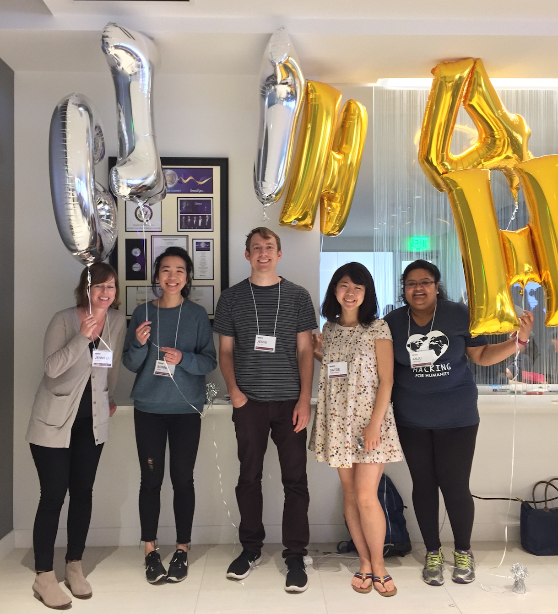

# Bay Area Help

This project was built by a team of 5 engineers and designers during a hackathon hosted by [Hacking For Humanity and Girls in Tech](http://hackingforhumanity.girlsintech.org/) 

We are dedicated to helping victims of domestic abuse develop a safety plan, escape their abusers, and live fulfilling and abuse-free lives. We aim to put victims in touch with needed resources, by making resources easy to find, and providing helpful advice along the way.
